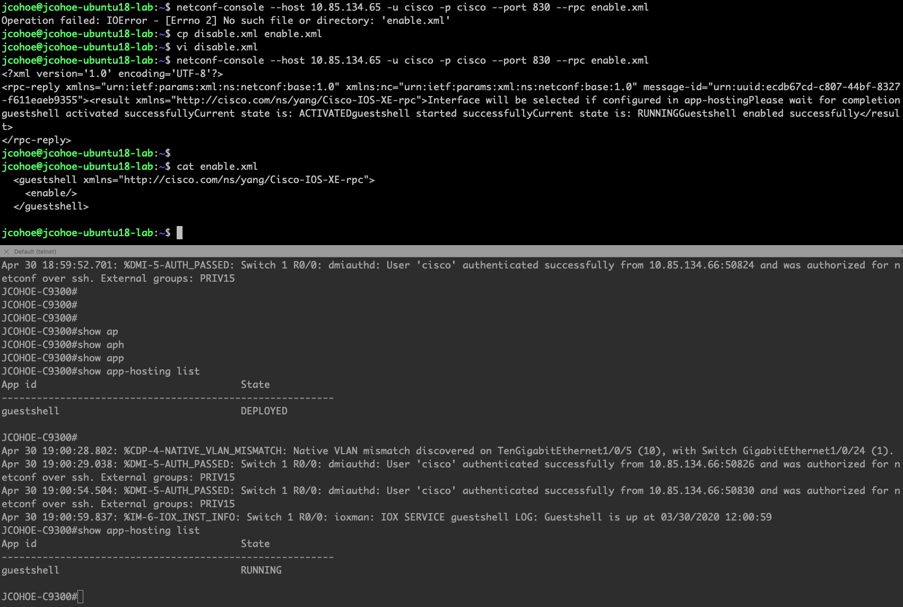

Example to enable and disable the Guest Shell feature via NETCONF and netconf-console:

$ netconf-console --host 10.85.134.65 -u cisco -p cisco --port 830 --rpc disable.xml

or

$ netconf-console --host 10.85.134.65 -u cisco -p cisco --port 830 --rpc enable.xml

disable.xml:
```<guestshell xmlns="http://cisco.com/ns/yang/Cisco-IOS-XE-rpc"><disable/></guestshell>```

enable.xml:
```<guestshell xmlns="http://cisco.com/ns/yang/Cisco-IOS-XE-rpc"><enable/></guestshell>```

Example screenshot:


